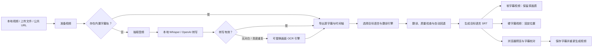
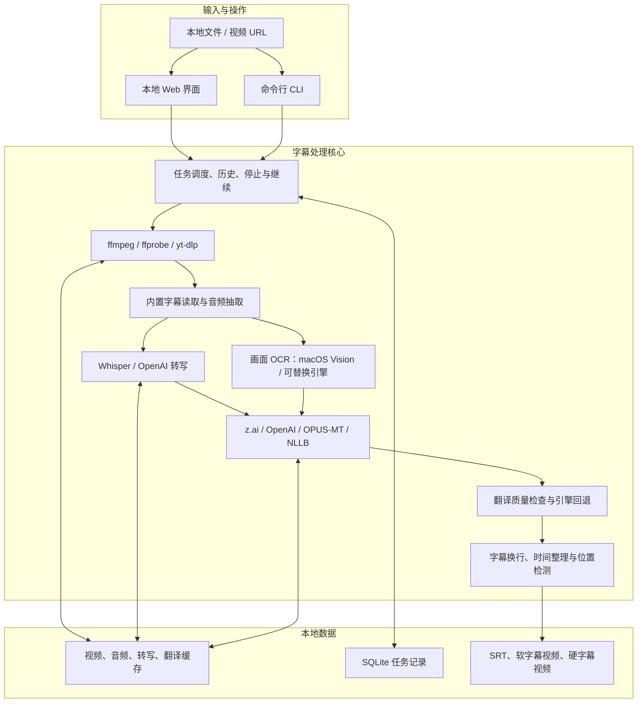

# 本地多语言视频字幕工具

[中文首页](README.md) · [完整使用指南](docs/使用指南.md) · [更新记录](docs/更新记录.md) · [English](README.en.md)

输入一个**本地视频、上传文件或公开视频网址**，工具会自动取得源字幕或识别视频语音，再生成一种或多种目标语言的 `.srt` 字幕。需要时，还可以输出保留原画质的软字幕视频，或固定位置显示的硬字幕视频。

项目同时提供本地 Web 界面和命令行，适合个人在 macOS 上处理日语、中文、英语及其他常见语言的视频。

## 项目亮点

- **多种输入**：本地路径、网页上传、YouTube（含 Shorts / Live / Embed）、Bilibili，以及其它公开单视频网址的通用尝试下载。
- **智能字幕来源**：优先读取视频内置字幕；没有字幕轨时识别语音；语音为空或高度重复时，可在 macOS 上自动读取画面硬字幕。
- **多语言翻译**：支持 z.ai、OpenAI、本地中/日/英快速模型，以及 NLLB 1.3B 本地多语言模型。
- **稳定回退**：z.ai 限流或翻译失败时，可自动切换本地模型；本地结果不合格时再尝试 OpenAI。
- **质量保护**：检测空字幕、重复内容、异常长度、语言不匹配，并对 NLLB 异常句进行单句重试。
- **多种成品**：输出外挂 `.srt`、可开关软字幕 MP4，或固定位置硬字幕 MP4。
- **字幕避让**：分析视频顶部和底部的文字区域，把新硬字幕放到更合适的位置，减少与原画面字幕重叠。
- **预览与校对**：任务完成后可在浏览器中播放视频、同步查看字幕、修改文字和时间轴，再重新生成视频。
- **任务可靠性**：实时进度、时间戳日志、停止任务、任务历史、失败继续、缓存复用和重复提交保护。
- **本地优先**：视频、模型、缓存、任务记录和输出均保存在当前电脑，不需要单独部署服务端。

## 处理流程



## 系统架构



## 快速开始

### 1. 安装基础工具

```bash
brew install ffmpeg
brew install ffmpeg-full
brew install whisper-cpp
brew install yt-dlp
```

安装 Python 依赖：

```bash
python3 -m pip install -e .
python3 -m pip install transformers sentencepiece torch protobuf
```

下载基础 Whisper 模型：

```bash
mkdir -p models
curl -L https://huggingface.co/ggerganov/whisper.cpp/resolve/main/ggml-base.bin -o models/ggml-base.bin
```

完整的 VAD、本地翻译模型和 API 配置见[完整使用指南](docs/使用指南.md)。

### 2. 配置云端模型（可选）

```bash
cp .env.example .env
```

按需要填写：

```text
OPENAI_API_KEY=
ZAI_API_KEY=
ZAI_API_BASE=https://open.bigmodel.cn/api/paas/v4/
ZAI_MODEL=glm-4.7-flash
```

只使用本地 Whisper 和本地翻译模型时，可以不配置云端 Key。

### 3. 启动 Web 界面

仅本机访问：

```bash
env PYTHONPATH=src python3 -m subtitle_tool.web --host 127.0.0.1 --port 7860
```

浏览器打开 [http://127.0.0.1:7860](http://127.0.0.1:7860)。

允许可信局域网设备访问：

```bash
env PYTHONPATH=src python3 -m subtitle_tool.web --host 0.0.0.0 --port 7860
```

当前 Web 页面没有登录保护，局域网模式只适合可信网络。

## 常见使用方式

### 本地视频生成中文字幕

```bash
env PYTHONPATH=src python3 -m subtitle_tool.cli input.mp4 \
  --source-lang ja \
  --target-lang zh-CN \
  --transcriber local-whisper \
  --translator z-ai \
  --embed-subtitles \
  --out-dir output
```

### 远程视频生成日语和英语字幕

```bash
env PYTHONPATH=src python3 -m subtitle_tool.cli 'https://www.youtube.com/watch?v=VIDEO_ID' \
  --source-lang auto \
  --target-lang ja \
  --target-lang en \
  --transcriber local-whisper \
  --translator z-ai \
  --embed-subtitles \
  --out-dir output
```

### 只下载视频

```bash
env PYTHONPATH=src python3 -m subtitle_tool.cli 'https://example.com/video' \
  --download-only \
  --out-dir output
```

通用网址下载属于尽力尝试：需要登录、Cookie、DRM、地区授权或特殊播放器的网站可能无法下载。

### 无对白视频读取画面字幕

macOS 可直接使用系统 Vision OCR，不需要额外下载 OCR 模型：

```bash
env PYTHONPATH=src python3 -m subtitle_tool.cli input.mp4 \
  --source screen-ocr \
  --source-lang ja \
  --target-lang zh-CN \
  --translator z-ai \
  --out-dir output
```

默认的 `--source auto` 也会在语音转写为空或出现大段重复幻觉时自动切换画面 OCR。OCR 引擎通过统一接口接入；当前提供 macOS Vision，后续可在 Linux 服务器替换为 PaddleOCR、Tesseract 或云端 OCR。

## 翻译引擎怎么选

| 引擎 | 适合场景 | 特点 |
| --- | --- | --- |
| z.ai | 默认在线多语言翻译 | 语言覆盖广；可能遇到账号限流 |
| OpenAI | 高质量在线备用 | 质量稳定；需要 API Key 并产生 API 费用 |
| 本地快速模型 | 中、日、英离线粗翻 | 速度快、模型较小；支持方向有限 |
| NLLB 1.3B | 更多语言的本地翻译 | 离线、覆盖广、质量优先；模型较大、CPU 推理较慢 |

转写和翻译不是一件事：Whisper 负责“听懂视频在说什么”，翻译模型负责“把源字幕转换成目标语言”。

## 输出结果

每次任务都会建立独立时间戳目录：

```text
output/<video-name>.<YYYYMMDDHHMMSSX>/
  <video-name>.<timestamp>.mp4
  <video-name>.<timestamp>.source.<source-lang>.srt
  <video-name>.<timestamp>.<target-lang>.srt
  <video-name>.<timestamp>.<target-lang>.default-sub.mp4
  <video-name>.<timestamp>.<target-lang>.fixed-sub.mp4
```

- `*.srt`：外挂字幕，可在播放器或剪辑软件中单独使用。
- `*.default-sub.mp4`：软字幕视频，字幕可开关，视频流保持原画质。
- `*.fixed-sub.mp4`：硬字幕视频，字幕固定在画面中，需要重新编码。

软字幕推荐使用 IINA 或 VLC 验证。QuickTime 对部分 MP4 软字幕轨的显示兼容性有限。

## 近期更新

- 新增可替换的画面字幕 OCR 引擎架构；macOS 首个实现使用系统 Vision，不需要额外下载 OCR 模型。
- 自动字幕来源会识别 Whisper 空结果和高度重复幻觉，并切换画面 OCR；也可手动选择“画面字幕 OCR”。
- OCR 对连续帧文字进行位置、置信度、纯数字噪声和相似文本合并，生成可翻译的源 SRT 时间轴。
- z.ai 在某个目标语言超时或失败后，会在当前任务内熔断；其余目标语言直接进入本地/OpenAI 回退链路，避免重复等待相同故障。
- 翻译批次完成时会同步更新任务总百分比，并显示目标语言与已完成字幕条数，不再让长时间翻译一直停在同一个百分比。
- 完全相同的源字幕会在单次任务中合并翻译，再按原索引展开到完整时间轴，减少重复模型推理。
- 翻译引擎名称、兼容别名、缓存身份和环境检查改为统一配置，减少 Web、CLI 与处理流程之间的重复定义。
- Web 表单将模型路径、硬字幕编码和性能开关归入“高级设置”，常用的输入、语言、字幕来源与翻译选项保持在首屏。
- NLLB 1.3B 会根据 CPU、Metal 和可用内存选择批量；内存不足时自动缩小批量，并在日志中显示批次进度、已用时间和预计剩余时间。
- NLLB 每完成一批即保存翻译断点；任务失败、停止或服务重启后继续时，只处理尚未完成的字幕。
- 本地多语言翻译统一使用 NLLB 1.3B；600M 不再出现在 Web、环境检查和自动回退中，旧 CLI 参数继续兼容。
- Whisper 支持 Metal/GPU 加速和 VAD 跳过静音；当 GPU、VAD 或转写结果不可用时，会按 `Metal + VAD -> CPU + VAD -> CPU 标准转写` 自动降级。
- 视频解析、下载、语音转写和硬字幕烧录增加超时保护与定时心跳日志，长时间无输出时会明确提示当前状态并自动停止异常进程。
- 常见失败会显示中文处理建议，同时保留技术信息，方便判断应关闭 VAD、切换模型、重试下载或检查网络。
- 硬字幕支持 Apple VideoToolbox、快速 CPU 和高质量 CPU 编码，并显示真实百分比、速度和预计剩余时间。
- Web 前后端共同阻止连续点击和重复提交，页面刷新后可恢复当前任务状态。
- 任务历史支持安全清空已结束记录；缓存支持分类清理和一键清空全部，并在删除前明确提示影响范围。
- 加入 NLLB 1.3B、多语言质量检查、异常句重试、翻译缓存和云端限流回退。
- 加入画面字幕位置检测、自动避让、字幕预览校对和保存后重新生成视频。
- 加入任务历史、失败继续、分类缓存管理和通用公开视频网址尝试下载。

完整变化见[更新记录](docs/更新记录.md)和[性能与任务安全技术说明](docs/2026-07-13-performance-and-task-safety.md)。

## 文档导航

- [完整使用指南](docs/使用指南.md)：安装、配置、Web、CLI、模型、缓存、字幕编辑和故障排查。
- [更新记录](docs/更新记录.md)：按阶段查看项目能力变化。
- [English README](README.en.md)：英文项目简介和快速启动。
- [性能与任务安全更新](docs/2026-07-13-performance-and-task-safety.md)：最近一轮性能优化的详细说明。

## 当前限制

- 画面 OCR 当前首个实现仅支持 macOS Vision；Linux / Windows 需要接入其它兼容引擎。
- OCR 对花体字、快速动画、低清画面、台标和同屏大量文字的识别可能不完整，生成后建议使用字幕校对功能检查。
- 通用下载不保证支持所有网站，也不绕过 DRM、登录、付费或地区限制。
- 本地 Whisper `base` 模型和小型翻译模型适合快速试跑，不代表最高识别或翻译质量。
- 硬字幕需要重新编码，长视频和高分辨率视频会消耗较多时间。
- 自动字幕位置检测是视觉启发式分析，复杂台标、弹幕或大量画面文字可能降低置信度。
- 任务历史和缓存保存在当前电脑，不会自动同步到其它设备。

## 开发验证

```bash
python3 -m unittest discover -s tests
env PYTHONPYCACHEPREFIX=/private/tmp/subtitle-tool-pycache python3 -m compileall src tests
```

项目不会提交 `.env`、`output/`、本地模型、缓存和任务数据库。
