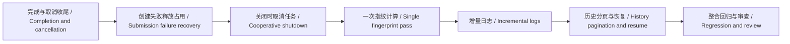

# 高、中优先级优化 / High and Medium Priority Improvements

本轮处理上次审查列出的六项高、中优先级问题；验收覆盖任务竞争、存储失败、进程退出、长视频读取、日志增量和旧历史恢复。

This round addresses the six high and medium priority findings from the previous review. Acceptance covers task races, storage failures, process shutdown, video reads, incremental logs, and older history recovery.

## 实施顺序 / Implementation order



## 行为变化 / Behavior changes

1. **任务终态 / Terminal states**：完成、失败与取消在同一任务锁下决定最终状态。任务执行过程中已接受的取消请求在收尾时优先落为“已停止”，避免停留在“正在停止”。线程最终异常也有收尾处理。

   Completion, failure, and cancellation resolve under the same job lock. A cancellation accepted before finalization becomes a terminal canceled state. Final worker exceptions are observed so unfinished reservations cannot block the next job.

2. **创建失败 / Submission failures**：数据库保存成功后才将新任务发布到内存。线程池拒绝提交时，任务记为失败并释放活动占用，上传保留供重试。存储仍不可用时保留内存诊断；重启会将数据库中的未完成任务标为中断。

   Jobs enter the in-memory registry only after persistence succeeds. Rejected executor submissions become failed jobs and release the active reservation while retaining retryable uploads. If storage remains unavailable, diagnostics remain in memory; restart marks persisted unfinished jobs as interrupted.

3. **服务退出 / Service shutdown**：Ctrl+C 后拒绝新任务，通知活动任务取消，再等待线程清理。已入队任务也运行取消检查并释放资源。正在执行的一次同步模型推理或 SDK 请求仍需返回或超时，无法承诺立即退出。

   Ctrl+C stops job admission, signals cancellation, and waits for worker cleanup. Queued workers also perform cancellation cleanup. An active synchronous inference or SDK request must still return or time out; shutdown is not guaranteed to be immediate.

4. **指纹 / Fingerprints**：一次任务只完整读取视频计算一次内容指纹，字幕来源阶段直接复用。独立调用仍重新计算完整内容，避免因大小或修改时间相同而误命中缓存。每 1 MiB 检查取消，常规进度通知最多每半秒一次。

   Each pipeline computes the full video fingerprint once and reuses it during source selection. Independent calls still hash current content, preventing false cache hits from matching sizes or timestamps. Cancellation is checked every 1 MiB and regular progress is throttled to twice per second.

5. **日志 / Logs**：SQLite 使用独立的有序日志表，任务进度更新只追加新增日志，保存成功才推进游标。旧 `logs_json` 自动在事务中迁移，重复启动不会重复迁移。运行期间状态库被删除重建时，可从活动任务的内存日志恢复；已有记录的游标冲突仍会报错。页面按游标获取并追加新日志，任务完成后继续读完剩余日志。

   SQLite stores ordered log rows separately. Progress updates append only new entries and advance the cursor after commit. Legacy `logs_json` is migrated atomically without duplication on reopening. If the state database is deleted and recreated during a live job, its in-memory logs can restore the missing record; cursor conflicts on existing records remain errors. The UI fetches and appends new log chunks by cursor, draining remaining entries after completion.

6. **历史 / History**：列表按创建时间和任务 ID 稳定排序，每页默认 50 条。启动和列表不加载历史日志正文；详情与恢复按任务 ID 从数据库读取，因此超过前 50 条的记录也可查看和恢复。恢复仍检查当前服务允许的目录。

   History is ordered by creation time and job ID with 50 entries per page by default. Startup and listings do not load historical log bodies. Details and resume load by ID, including records older than the first 50. Resume still validates current server directory permissions.

## 接口 / API

| 请求 / Request | 返回 / Response |
| --- | --- |
| `GET /api/jobs?offset=0&limit=50` | `jobs`、`activeJob`、`offset`、`limit`、`total`、`hasMore`；列表日志为空，`logsIncluded=false` / Metadata and pagination; listing logs are omitted |
| `GET /api/jobs/<id>?logOffset=0&logLimit=200` | 日志片段及 `logOffset`、`nextLogOffset`、`logTotal`、`hasMoreLogs` / Log chunk and cursor metadata |
| `GET /api/jobs/<id>` | 保留完整日志读取兼容入口 / Compatible full-log detail response |

列表页大小限制为 1–100，日志块限制为 1–1000；负数、非整数、重复参数和越界值返回 400。页面调用增量接口；旧详情接口用于兼容。

Page sizes are limited to 1–100 and log chunks to 1–1000. Negative, non-integer, repeated, or out-of-range parameters return 400. The UI uses incremental reads; the full-detail route remains for compatibility.

## 验证 / Verification

- Python 完整回归：322 项通过，0 失败（18.802 秒），包含实际 HTTP、真实媒体流程和独立进程 Ctrl+C 退出用例。
- Python regression: all 322 tests passed in 18.802 seconds, including real HTTP, media processing, and subprocess Ctrl+C shutdown.
- 前端 15 项 Node 测试通过，覆盖分块日志、任务切换、过期响应、重连以及浏览旧任务时后台任务结束后的按钮恢复；Python 编译和四份 JavaScript 语法检查通过。
- All 15 Node tests passed, covering log chunks, selection changes, stale responses, reconnects, and automatic control updates while viewing history. Python compilation and syntax checks for four JavaScript files passed.
- 浏览器实测：55 条合成任务正确分成两页；最早任务的 420 行日志完整且唯一，刷新回到第一页；页面无控制台错误。
- Browser smoke: 55 synthetic jobs span two pages; all 420 lines of the oldest job load exactly once, refresh returns to page one, and no console errors appear.
- 独立后台审查发现并修复状态数据库删除后的日志游标恢复问题，补充了回归测试。
- Independent backend review found and fixed log cursor recovery after database removal, with regression coverage.

```bash
env PYTHONDONTWRITEBYTECODE=1 PYTHONPATH=src python3 -m unittest discover -s tests
node --test tests/test_job_state.cjs tests/test_web_ui.cjs
env PYTHONPYCACHEPREFIX=/private/tmp/subtitle-tool-pycache python3 -m compileall -q src tests
node --check src/subtitle_tool/web_assets/app.js
node --check src/subtitle_tool/web_assets/job_state.js
node --check src/subtitle_tool/web_assets/session.js
node --check src/subtitle_tool/web_assets/language_catalog.js
git diff --check
```

本次未实际调用外部云端模型；正在执行的同步推理或请求仍受其返回及超时约束。低优先级的持续集成和依赖版本管理未纳入本轮。

External cloud models were not called. Active synchronous inference or requests remain subject to completion or timeout. Low-priority continuous integration and dependency version management are outside this round.
