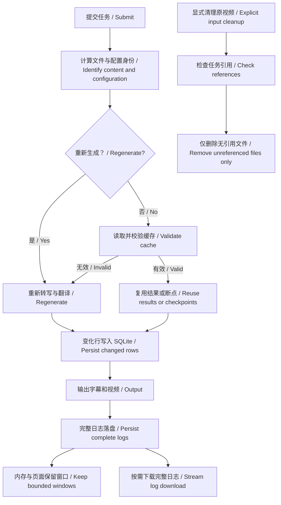

# 剩余优化：异常恢复、缓存与资源管理
# Remaining hardening: recovery, caches and resource management

## 本轮范围 / Scope

落实 2026-09-30 分析中的 7 项建议：进程异常清理、缓存容错、配置身份、保留原视频管理、日志内存上限、自动回归和依赖锁定、翻译断点增量写入。

Implements the seven approved improvements: process cleanup, cache validation, configuration identity, retained input management, bounded logs, automated regression with pinned dependencies, and incremental translation checkpoints.

| 项目 / Area | 行为 / Behavior |
| --- | --- |
| 外部进程 / Processes | 回调、读取异常会终止并回收子进程；管道提前关闭仍检查取消和超时。Callback/read failures terminate and reap children; EOF does not disable timeout/cancellation. |
| 缓存格式 / Cache shape | 严格校验索引、文本和引擎；无效 JSON/字段按未命中处理；损坏 SQLite 保留 `.corrupt` 副本后重建。Validate indexes/text/engine; invalid data is a miss; corrupt SQLite files are quarantined and rebuilt. |
| 模型配置 / Model configuration | 翻译缓存包含模型、服务地址、回退配置和策略版本；转写识别本地模型路径、大小、mtime、ctime、inode 及 VAD，云端识别模型和地址。Keys include effective model/endpoint and version; local transcription tracks model/VAD file signatures. |
| 原视频 / Retained inputs | 单独统计 `.inputs`，显式清理无引用文件；所有仍保留的任务记录均保护其输入，包括重试与编辑任务。Account for `.inputs` separately; explicit cleanup protects all retained job references, including resume/render. |
| 日志 / Logs | 后端与页面各保留最多 1000 条且不超过约 1 Mi 字符；完整日志保存在 SQLite，可分块下载。Memory/UI retain at most 1000 entries and roughly 1 Mi characters; SQLite keeps complete logs for streamed download. |
| 回归 / Regression | GitHub Actions 覆盖 Python 3.9/3.12、Node 24、FFmpeg；核心依赖版本固定。CI covers Python 3.9/3.12, Node 24 and FFmpeg with pinned core dependencies. |
| 翻译断点 / Checkpoints | 每目标语言仅计算一次身份；按变化行写入 SQLite；事务与文件锁保护多进程写入和损坏恢复。One identity per target; changed-row SQLite writes; transactions/file locks protect independent writers and corruption recovery. |

## 使用入口 / User controls

- 勾选“重新转写和翻译”，或 CLI 使用 `--force-regenerate`。本次忽略语音转写与翻译缓存，保留视频下载和音频缓存的复用。此选项不保存为默认偏好；续跑任务沿用原任务参数，若原任务启用了此选项也会重新生成。
- 缓存卡片显示“保留的上传原视频”总量与可清理量。任务历史仍引用的原视频不会清理。先清空不需要的任务历史，再点击“清理无引用原视频”；确认框会说明删除范围。运行任务期间拒绝清理。生成的视频和字幕不属于此清理范围。
- 日志区“复制当前日志”复制当前窗口；“下载完整日志”读取服务器完整日志快照，并脱敏令牌/密钥。新增日志不包含在已经开始的下载快照中。

Use the regeneration checkbox or `--force-regenerate` to bypass transcription/translation caches while reusing downloaded media/audio. It is not a saved default; resumed tasks inherit their original flag. Retained input cleanup requires an explicit confirmation, protects job references and rejects active processing. Copy uses the visible window; download streams a sanitized snapshot of complete server logs.

## 流程图 / Flow



## 工程说明 / Engineering notes

- `cache_identity.py` 管理身份与处理版本。变更提示词、推理参数或回退策略时必须递增版本。云端同名模型服务内部更新、远程模型同名版本更新无法自动识别；需要强制重新生成。本地模型使用元数据签名，避免每次额外读取数 GB 模型。
- 新身份不复用旧版本未包含配置的缓存；旧文件仍可通过分类缓存清理删除。兼容有效的当前身份 JSON，首次保存迁移至 SQLite。每个翻译身份各有 `.sqlite3` 与 `.lock` 文件，`.corrupt` 为最近损坏副本。
- 普通外部进程调用仍可请求完整结构化输出；FFmpeg、Whisper、下载进度等诊断输出保留末尾 1 MiB。流式进度单行超过 1 MiB 报错并清理子进程。
- 服务中最多保留约 20 个已结束且成功持久化的任务对象，历史查询从数据库按需读取。持久化失败不丢弃未写入日志。
- 若数据库被外部删除，只能恢复仍在内存中的日志窗口；恢复记录明确提示较早日志丢失。无持久化的开发模式也只保留窗口。
- 原视频遍历/删除使用目录句柄和 `O_NOFOLLOW`，跳过嵌套符号链接。此实现沿用项目现有 macOS/Linux 运行范围。

Increment processing revisions when prompts/inference/fallback behavior changes. Same-name remote model updates require explicit regeneration. Old incomplete identities are intentionally cold. Diagnostic output is bounded while structured probe output remains complete. Database deletion cannot recover evicted text and is disclosed. Input cleanup uses non-following directory descriptors on macOS/Linux.

## 可复现验证 / Reproducible verification

```bash
python3 -m venv .venv
.venv/bin/python -m pip install -r requirements-core.lock
.venv/bin/python -m pip install --no-deps -e .
PYTHONPATH=src .venv/bin/python -m unittest discover -s tests -v
node --test tests/*.cjs
```

`requirements-core.lock` 固定核心运行依赖及其传递依赖版本；不包含体积很大的可选本地推理包、模型权重、FFmpeg 和平台构建工具。更新依赖需重新验证干净环境；CI 不需要 API 密钥且禁止 Hugging Face 联网下载模型。工作流参考 [checkout](https://github.com/actions/checkout)、[setup-python](https://github.com/actions/setup-python)、[setup-node](https://github.com/actions/setup-node) 官方用法。

The lock pins core runtime versions, excluding optional inference packages, weights, FFmpeg and platform build tools. Revalidate in a clean environment after changes. CI needs no API keys and disables model downloads.

### 验证记录 / Verification record

- Python 3.9：350 项通过，12.469 秒。
- 全新 Python 3.11 核心依赖环境：350 项通过，12.092 秒；依赖兼容检查通过。
- Node：17 项通过；4 个前端脚本语法、Python 编译和差异空白检查通过。
- 实际浏览器：1250 条合成日志显示最后 1000 条，下载完整 1250 条；原视频占用与清理确认正常，无控制台错误。验证未清理真实用户文件，临时服务、页面和下载已清理。
- 独立审查发现 3 个 P2 边界：数据页损坏恢复、已完成任务数据库丢失后的日志、父进程退出后的子孙清理；均补失败回归用例后修复，最终全量通过。双进程断点合并、日志丢失后的下载以及旧位置参数兼容性也已覆盖。
- 未调用真实付费 API，未下载/评测真实模型。GitHub 托管执行结果以远程 Actions 状态为准。

Both local Python environments passed 350 tests; Node passed 17. Browser smoke verified bounded display and complete downloads using synthetic data. Three independent-review findings were reproduced and fixed before the final green suites. Live paid providers/model quality were not exercised; hosted CI status is reported separately.
