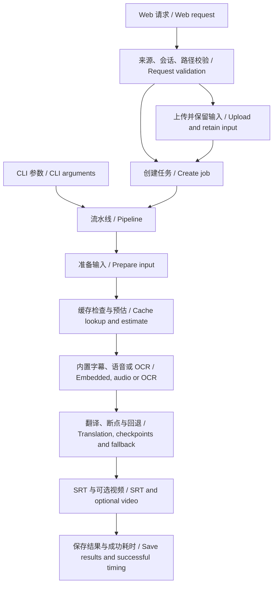

# 开发与维护 / Development and Maintenance

[中文首页](../README.md) · [English README](../README.en.md) · [使用指南 / User guide](使用指南.md)

本文说明可靠性优化后的模块边界、关键约束和验证方法。功能使用与启动参数见使用指南。

This document describes module boundaries, key invariants, and verification after the reliability improvements. See the user guide for usage and startup options.

## 模块职责 / Module responsibilities

| 模块 / Module | 职责 / Responsibility |
| --- | --- |
| `web.py` | 服务启动、任务状态与持久化 / Service startup, job state, and persistence |
| `web_http.py`、`web_security.py` | HTTP 路由、来源与会话校验、目录和请求体限制 / HTTP routing, origin and session checks, path and body limits |
| `upload_store.py` | 流式上传、占用、保留及过期清理 / Streaming uploads, claims, retention, and expiry cleanup |
| `pipeline.py`、`input_resolution.py` | 流水线编排、本地与远程输入准备 / Pipeline orchestration and local or remote input preparation |
| `source_selection.py`、`source_quality.py` | 按成本选择字幕来源并评估质量 / Source selection by cost and quality assessment |
| `translation_scheduler.py` | 引擎尝试、回退、断点、取消与来源记录 / Provider attempts, fallback, checkpoints, cancellation, and provenance |
| `asset_cache.py` | 完整内容指纹与阶段缓存 / Full-content fingerprints and stage caches |
| `processing_diagnostics.py`、`processing_estimate.py`、`estimate_history.py` | 阶段预估、区间和本机历史校准 / Stage estimates, ranges, and local calibration |
| `user_settings.py`、`log_sanitizer.py`、`onboarding.py` | 偏好校验、诊断脱敏和环境指引 / Preference validation, diagnostic sanitization, and setup guidance |

## 处理路径 / Processing flow



仅下载任务在输入准备后返回；手动选择的字幕来源不会被质量评分自动替换。自动模式按内置字幕、音频、画面 OCR 的顺序尝试，保留可用候选。

Download-only jobs return after input preparation. Quality scores do not override a manually chosen source. Automatic mode tries embedded subtitles, audio, then screen OCR, retaining usable candidates.

## 关键约束 / Key invariants

1. **请求与路径 / Requests and paths**：目录由服务端配置；校验与执行使用同一规范化输入，解析符号链接后检查范围。局域网要求至少 24 字符的 `SUBTITLE_TOOL_WEB_TOKEN`；浏览器用 HttpOnly 会话 Cookie。默认上传上限 2 GiB，可通过 `--max-upload-mb` 调整。允许目录通过 `--allow-input-dir` 和 `--allow-output-dir` 登记。

   Directories are configured by the server. Validation and execution use the same normalized input, with symlinks resolved before containment checks. LAN access requires a token of at least 24 characters; browsers use an HttpOnly session cookie. Uploads default to a 2 GiB limit, configurable with `--max-upload-mb`. Register directories with `--allow-input-dir` and `--allow-output-dir`.

2. **上传生命周期 / Upload lifecycle**：临时文件位于 `.subtitle-tool-state/uploads`。任务占用后保留到 `output/.inputs/<job-id>/`（使用自定义输出目录时位于该目录），成功保存新输入路径后才删除原上传。提交冲突或保留失败只释放占用，以便重试；未占用上传在启动或后续上传时按 24 小时过期清理。保留的任务输入不按临时上传规则删除。

   Temporary uploads live in `.subtitle-tool-state/uploads`. Claimed files are retained under `<output-dir>/.inputs/<job-id>/`; the original upload is deleted only after the new path is persisted. Submission conflicts or retention failures release the claim while preserving retryable files. Unclaimed uploads expire after 24 hours and are cleaned at startup or a later upload. Retained job inputs are outside temporary-upload expiry cleanup.

3. **取消与回退 / Cancellation and fallback**：`CancellationError` 直接传播，不触发下一引擎。成功批次写入断点，后续引擎复用已完成翻译；记录实际产出引擎。一次正在执行的同步模型推理或 SDK 请求需要返回或超时后才能响应取消。

   `CancellationError` propagates without starting another engine. Successful batches produce checkpoints reused by later engines, and actual producers are recorded. An active synchronous model inference or SDK call must return or time out before cancellation takes effect.

4. **缓存 / Caches**：视频身份使用带版本的完整文件哈希；语言参与内置字幕和 OCR 缓存身份。内置字幕经校验后原子发布，活动任务期间拒绝清理缓存。旧指纹的派生缓存会重新生成，原下载文件和独立翻译缓存仍可复用。

   Video identity uses a versioned full-file hash. Language is part of embedded-subtitle and OCR cache identity. Embedded subtitles are validated before atomic publication; cache cleanup is rejected while jobs are active. Derived caches with old fingerprints are rebuilt; downloaded files and independent translation caches remain reusable.

5. **设置与诊断 / Settings and diagnostics**：仅保存允许的非敏感设置，布尔值严格解析，损坏字段单独恢复。对外诊断脱敏作用于副本，保留功能路径和原始本地任务记录。

   Only allowed non-sensitive settings are saved. Booleans are parsed strictly and damaged preferences recover individually. Displayed diagnostics are sanitized on copies, preserving functional paths and original local job records.

6. **预估 / Estimates**：未知时长保持未知。区间是经验值，不是统计置信区间；只记录成功运行，并按同类配置校准。记录最多 100 个样本；写入失败不影响任务，多 CLI 进程并发可能丢失一个最新样本。

   Unknown durations remain unknown. Ranges are heuristic, not statistical confidence intervals. Only successful runs calibrate equivalent configurations. History holds at most 100 samples; write failures do not fail jobs, and concurrent CLI processes may lose a recent sample.

## 注释约定 / Comment convention

新增或修改的关键逻辑注释、模块说明和函数说明先写中文，再写对应英文。注释解释约束、兼容原因、失败恢复和状态转换；直接可读的语句无需逐行复述。公共参数、字段及 API 名称保持现有命名。

For new or revised comments, module documentation, and function documentation, write Chinese first and the corresponding English second. Explain invariants, compatibility, recovery, and state transitions without restating obvious statements. Preserve existing public parameter, field, and API names.

## 验证 / Verification

从项目根目录执行，HTTP 用例需要允许本机回环端口；真实媒体用例依赖 FFmpeg/ffprobe。

Run from the repository root. HTTP tests require loopback sockets; real-media tests require FFmpeg and ffprobe.

```bash
env PYTHONDONTWRITEBYTECODE=1 PYTHONPATH=src python3 -m unittest discover -s tests
env PYTHONPYCACHEPREFIX=/private/tmp/subtitle-tool-pycache python3 -m compileall -q src tests
node --check src/subtitle_tool/web_assets/app.js
node --check src/subtitle_tool/web_assets/session.js
node --check src/subtitle_tool/web_assets/language_catalog.js
git diff --check
```

2026-09-28 功能验收：283 项测试通过；真实 FFmpeg 双字幕轨短片验证语言选择、软字幕输出及缓存复用；独立 Web 进程验证启动、上传、仅下载任务和输入保留。没有实际调用付费或外部云端模型，云端回退与取消通过受控模拟验证。详细记录见[实施计划与验收](superpowers/plans/2026-09-27-reliability-completion.md)。

Functional acceptance on 2026-09-28: 283 tests passed. A real FFmpeg clip with two subtitle tracks verified language selection, soft-subtitle output, and cache reuse. A separate Web process verified startup, upload, download-only processing, and retained input. Paid or external cloud models were not called; cloud fallback and cancellation were verified with controlled simulations. See the [implementation and acceptance record](superpowers/plans/2026-09-27-reliability-completion.md).
